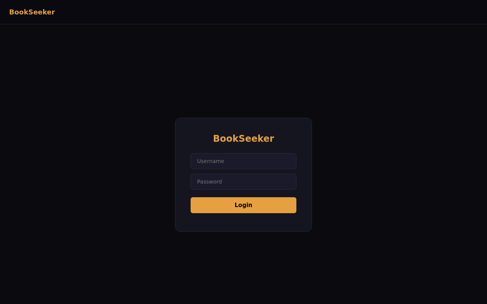
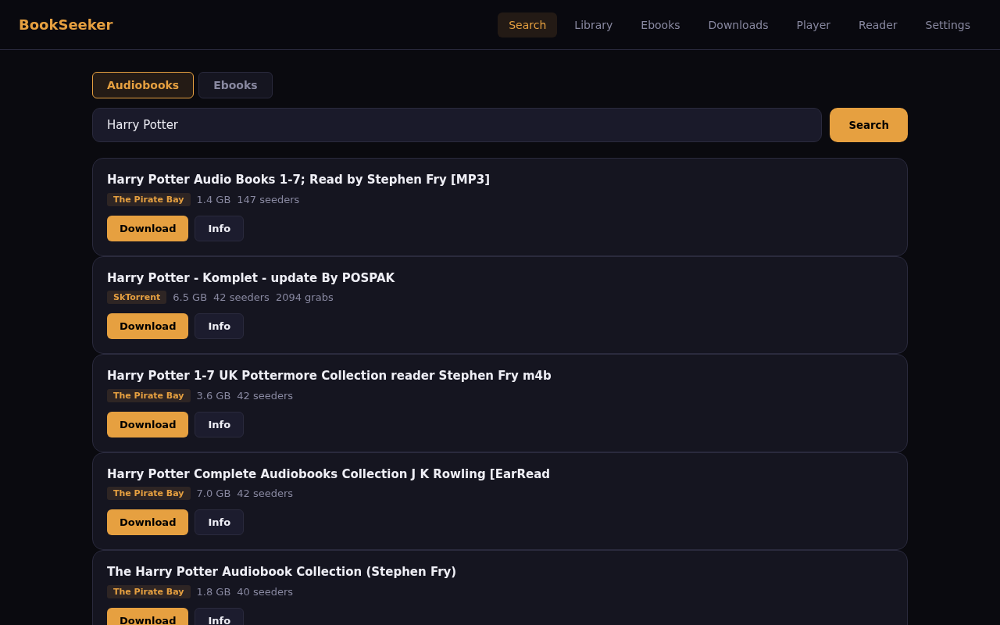
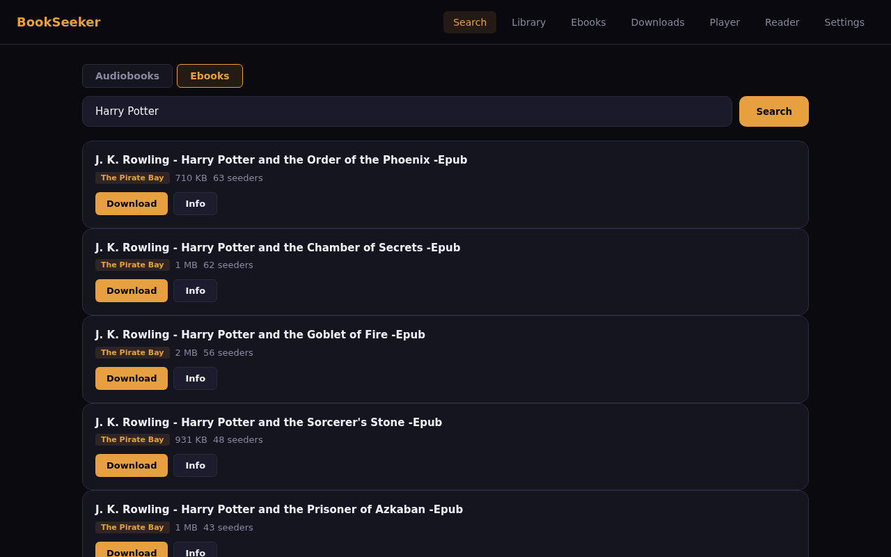
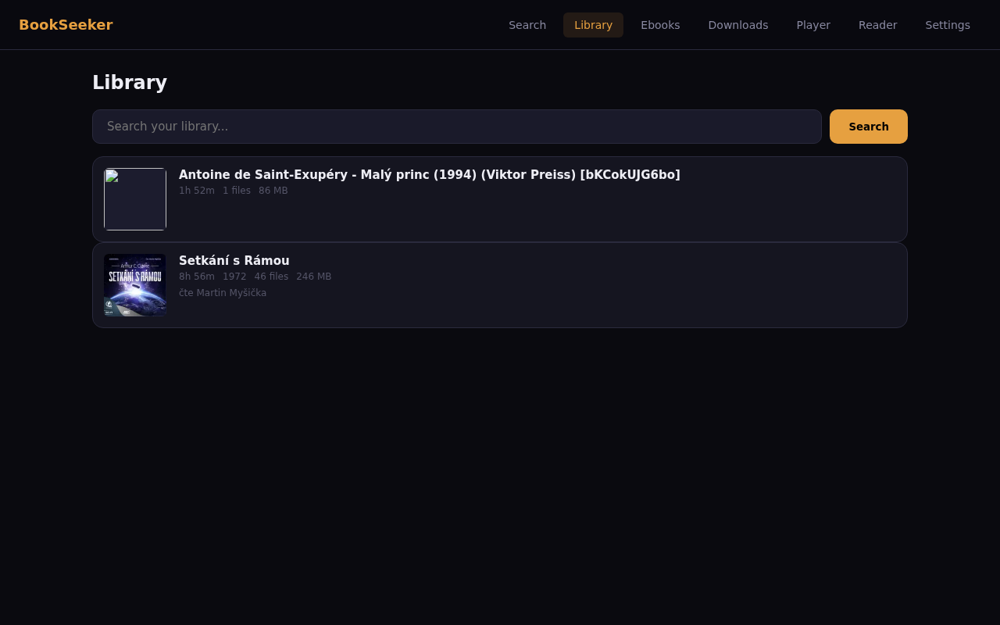
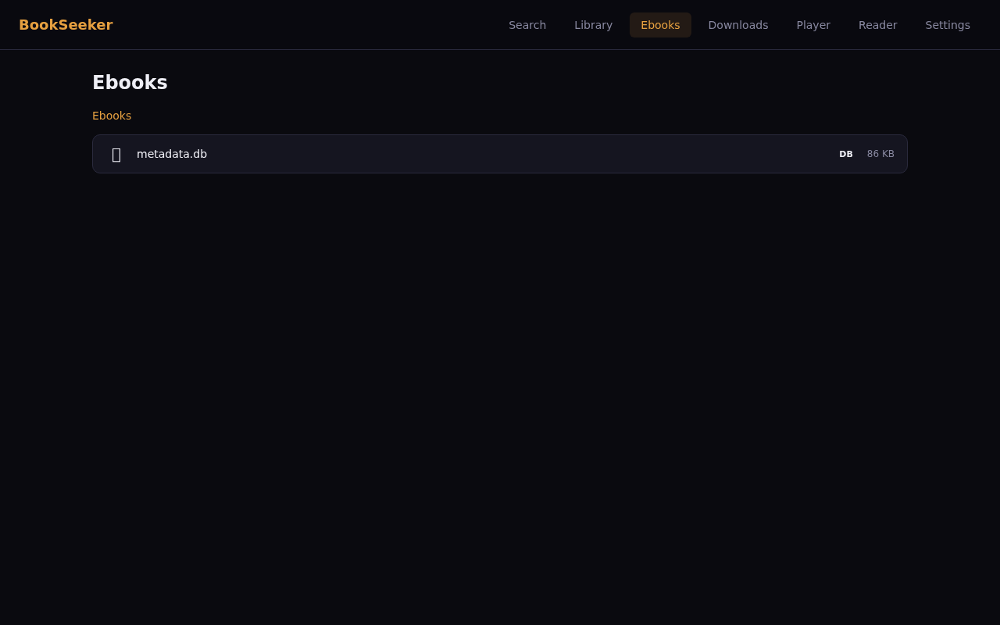
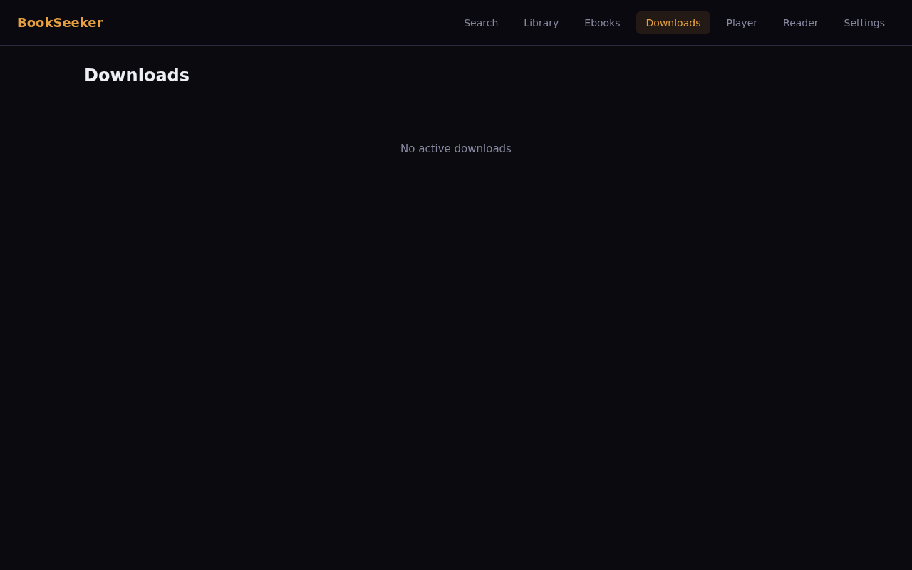
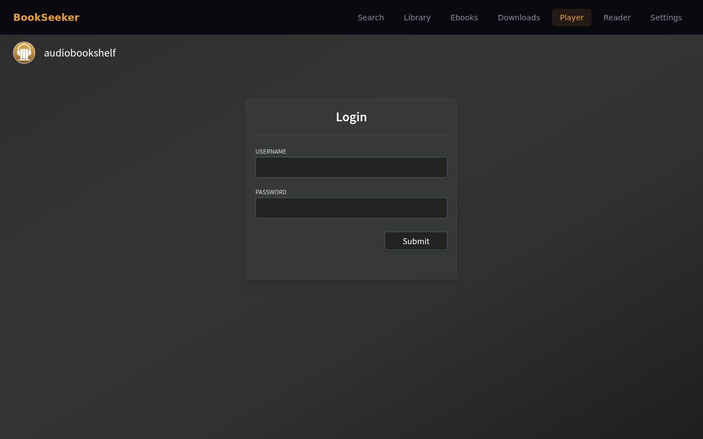
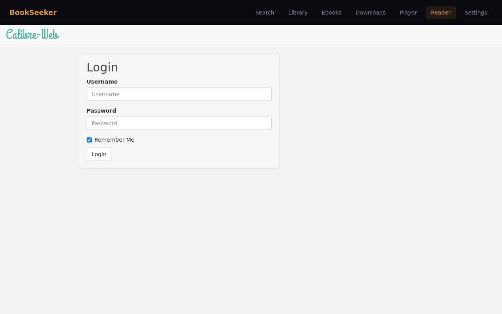
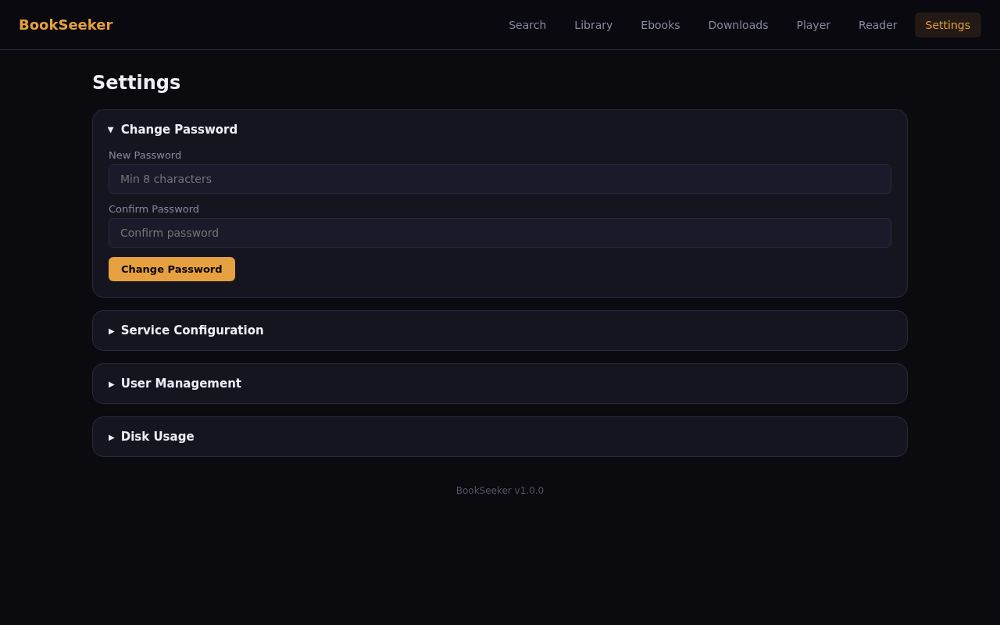

# BookSeeker

A self-hosted web app for searching, downloading, and managing audiobooks and ebooks. Search torrent trackers via [Prowlarr](https://github.com/Prowlarr/Prowlarr), download with [qBittorrent](https://github.com/qbittorrent/qBittorrent), and manage your library through [Audiobookshelf](https://github.com/advplyr/audiobookshelf) and [Calibre-Web](https://github.com/janeczku/calibre-web).

## Screenshots

### Login


### Audiobook Search
Search across multiple torrent trackers with one click. Toggle between audiobook and ebook search modes.



### Ebook Search
Switch to ebook mode to find epubs, PDFs, and other ebook formats.



### Library
Browse your Audiobookshelf library with cover art, duration, and metadata.



### Ebook File Browser
Browse and download ebook files directly to your device.



### Downloads
Monitor active torrent downloads with real-time progress tracking.



### Player (Audiobookshelf)
Embedded Audiobookshelf player — listen to audiobooks without leaving the app. Auto-login through proxy, no separate authentication needed.



### Reader (Calibre-Web)
Embedded Calibre-Web reader — browse and read ebooks without leaving the app. Auto-login through proxy, no separate authentication needed.



### Settings
Admin panel with password management, service configuration, user management, and disk usage monitoring.



## Features

- **Audiobook & Ebook Search** — Search multiple torrent trackers via Prowlarr (audio category 3000, books category 7000)
- **One-Click Downloads** — Send torrents to qBittorrent with automatic save path routing
- **Audiobookshelf Integration** — Browse your audiobook library with covers, metadata, and automatic library scanning after downloads
- **Ebook File Browser** — Browse downloaded ebooks and download them directly to your phone/device
- **Calibre-Web Integration** — Embedded Calibre-Web reader accessible from the app
- **Embedded Players** — Audiobookshelf and Calibre-Web are reverse-proxied with automatic login — no separate auth needed
- **User Management** — Admin can create/delete users, each user can change their own password
- **Settings Panel** — Configure all service URLs and API keys from the UI
- **Disk Usage** — Monitor and manage storage, delete audiobook folders with automatic ABS library scan
- **Dark UI** — Clean, responsive dark theme

## Architecture

```
BookSeeker (FastAPI + vanilla JS SPA)  :8091
├── Prowlarr        — torrent indexer aggregator
├── qBittorrent     — torrent client
├── Audiobookshelf  — audiobook library & player (proxied at /audiobookshelf/)
└── Calibre-Web     — ebook library & reader (proxied at /calibre/)
```

Audiobookshelf and Calibre-Web are **not exposed publicly** — they are accessed exclusively through BookSeeker's reverse proxy. BookSeeker handles authentication and auto-login to both services.

## Quick Start

### 1. Clone and configure

```bash
git clone https://github.com/lucashanak/BookSeeker.git
cd BookSeeker
cp .env.example .env
```

Edit `.env` with your values:

```env
ADMIN_USER=admin
ADMIN_PASS=your-secure-password

PROWLARR_API_KEY=your-prowlarr-api-key

ABS_USER=admin
ABS_PASS=your-abs-password

CALIBRE_USER=admin
CALIBRE_PASS=your-calibre-password

AUDIOBOOK_DIR=/path/to/your/audiobooks
EBOOK_DIR=/path/to/your/ebooks
```

### 2. Start all services

```bash
docker compose up -d
```

This starts BookSeeker along with all required services:
- **BookSeeker** on port `8091`
- **Audiobookshelf** (internal only, proxied through BookSeeker)
- **Calibre-Web** (internal only, proxied through BookSeeker)
- **Prowlarr** (internal only)
- **qBittorrent** (internal only)

### 3. Initial setup

1. Open `http://localhost:8091` and log in with your `ADMIN_USER`/`ADMIN_PASS`
2. **Prowlarr** — access Prowlarr at `http://localhost:9696` (or via `docker exec`) to add indexers and get the API key
3. **Audiobookshelf** — first access through the Player tab, create an admin account with the same credentials you set in `ABS_USER`/`ABS_PASS`, and set the base URL to `/audiobookshelf/` in ABS settings
4. **Calibre-Web** — first access through the Reader tab, default login is `admin`/`admin123`, then change the password to match `CALIBRE_PASS`
5. **qBittorrent** — check logs for the temporary admin password: `docker logs qbittorrent`

### Standalone (BookSeeker only)

If you already have Audiobookshelf, Calibre-Web, Prowlarr, and qBittorrent running separately:

```bash
docker build -t book-seeker .

docker run -d --name book-seeker \
  -p 8091:8091 \
  -v ./data:/app/data \
  -v /path/to/audiobooks:/audiobooks \
  -v /path/to/ebooks:/ebooks \
  -e PROWLARR_URL=http://prowlarr:9696 \
  -e PROWLARR_API_KEY=your-api-key \
  -e QBIT_URL=http://qbittorrent:8081 \
  -e QBIT_SAVE_PATH=/data/audiobooks \
  -e QBIT_EBOOK_SAVE_PATH=/data/ebooks \
  -e ABS_URL=http://audiobookshelf:80 \
  -e ABS_USER=admin \
  -e ABS_PASS=your-abs-password \
  -e CALIBRE_URL=http://calibre-web:8083 \
  -e CALIBRE_USER=admin \
  -e CALIBRE_PASS=your-calibre-password \
  -e ADMIN_USER=admin \
  -e ADMIN_PASS=your-admin-password \
  -e EBOOK_DIR=/ebooks \
  book-seeker
```

Make sure BookSeeker can reach the other services on the same Docker network.

### Audiobookshelf base path

Audiobookshelf **must** be configured with base URL `/audiobookshelf/` for the proxy to work correctly. Set this in ABS → Settings → Server Settings → Base URL.

## Environment Variables

| Variable | Description | Default |
|---|---|---|
| `ADMIN_USER` | BookSeeker admin username | `admin` |
| `ADMIN_PASS` | BookSeeker admin password | — |
| `PROWLARR_URL` | Prowlarr API URL | `http://prowlarr:9696` |
| `PROWLARR_API_KEY` | Prowlarr API key | — |
| `QBIT_URL` | qBittorrent Web UI URL | `http://qbittorrent:8081` |
| `QBIT_SAVE_PATH` | qBittorrent save path for audiobooks | — |
| `QBIT_EBOOK_SAVE_PATH` | qBittorrent save path for ebooks | — |
| `ABS_URL` | Audiobookshelf URL | `http://audiobookshelf:80` |
| `ABS_USER` | Audiobookshelf username (for auto-login) | `admin` |
| `ABS_PASS` | Audiobookshelf password (for auto-login) | — |
| `CALIBRE_URL` | Calibre-Web URL | `http://calibre-web:8083` |
| `CALIBRE_USER` | Calibre-Web username (for auto-login) | `admin` |
| `CALIBRE_PASS` | Calibre-Web password (for auto-login) | — |
| `EBOOK_DIR` | Ebook directory mount path | `/ebooks` |
| `TZ` | Timezone | `UTC` |
| `PORT` | BookSeeker port | `8091` |

## Tech Stack

- **Backend:** Python 3.11, FastAPI, httpx
- **Frontend:** Vanilla JavaScript SPA, CSS
- **Container:** Docker, Docker Compose
- **Services:** Prowlarr, qBittorrent, Audiobookshelf, Calibre-Web

## License

MIT
